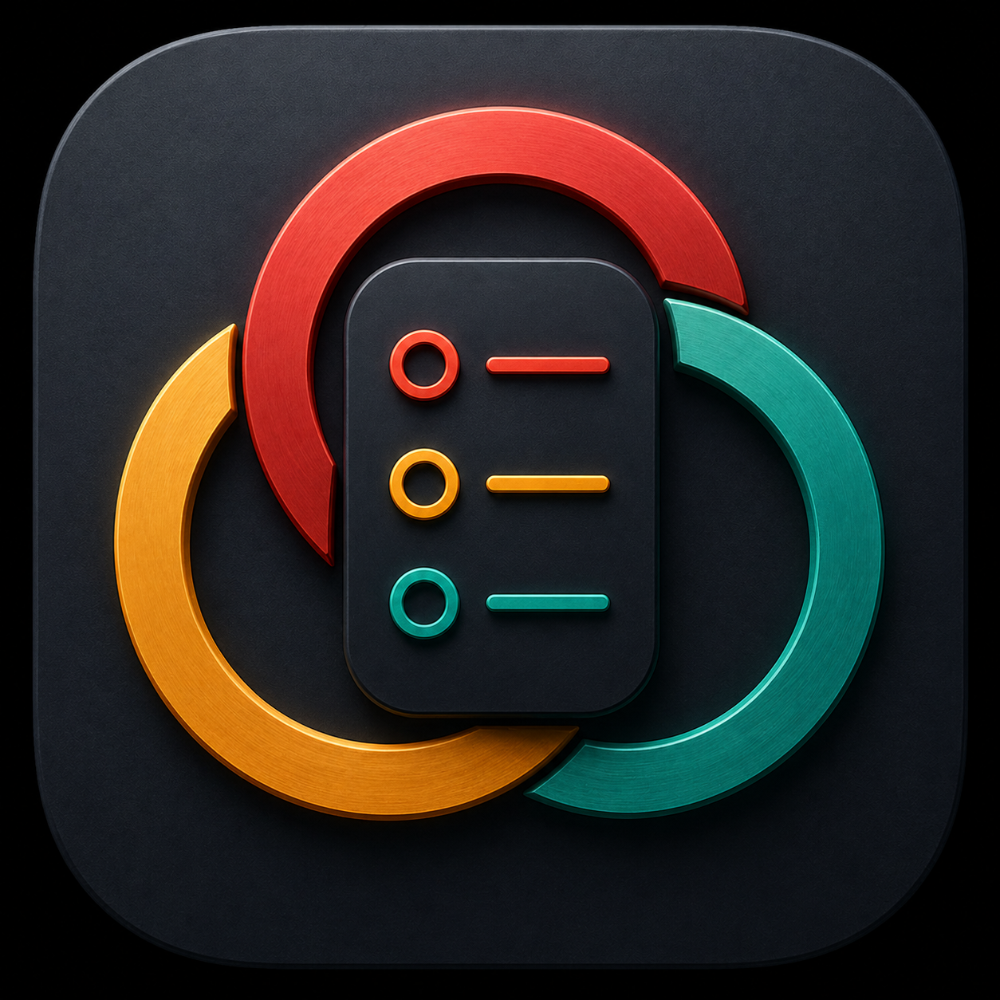

<p align="center">
  
</p>

# Triority

Triority is a private-first Android task, grocery, reminder, and AI triage app. It is built around quick capture, three practical priority tiers, optional Google sync, shared household-style lists, Android voice widgets, included tester AI, and optional bring-your-own AI provider access.

Triority is distributed as a signed Android APK through GitHub Releases. It is not currently distributed through the Play Store, so installation is a normal Android sideload.

## Install

The current public beta APK is published on GitHub Releases:

- Latest release: https://github.com/3Dendeavors/Triority/releases/latest
- Current beta: `v1.4.20`
- Android package id: `com.triority`
- Current APK: `Triority-v1.4.20.apk`
- SHA-256: `661E26DDE26FA186006D7823AB28FE886F06B144DA381085C8A63B0E5C907A21`

To install:

1. Open the latest release page on your Android device.
2. Under **Assets**, download `Triority-v1.4.20.apk`.
3. If Android asks, allow your browser or file manager to install unknown apps.
4. Open the downloaded APK and tap **Install**.
5. Launch Triority from your app drawer.

Use the APK asset for installs. The source-code `.zip` and `.tar.gz` files attached to GitHub tags are for developers and will not install the Android app.

Installed builds check this repo's `latest.json` and prompt when a newer APK is available. Installing a newer signed APK over the old one should preserve local app data as long as the package id and signing key match.

## What It Does

- Tasks organized into High, Medium, and Low tiers.
- Multiple task lists with drag reorder, archive/restore, reminders, and new-row focus shine.
- Grocery/material list with category sorting, Got It, recipe/project quantities, and duplicate protection.
- Shared task lists and one shared grocery page through optional sign-in and invite codes.
- Local and shared task reminders, with each device alerting only when that user allows notifications.
- Optional read-only Google Calendar conflict checks for reminder tasks.
- Included tester AI by default, plus optional AI triage using your own Gemini or Claude Sonnet API key, Personal Context, and current task/grocery workspace.
- AI-created and AI-organized grocery/material names keep sensible display capitalization without drifting into all-caps after repeated AI sort passes.
- Android launcher widgets for voice capture and Next Up previews.
- Themes, accent colors, widget appearance controls, and optional support through Buy Me a Coffee.

Support link: https://buymeacoffee.com/3DEndeavors

## Privacy

Triority is intended to have no analytics and no telemetry.

Network calls are limited to:

- Firebase for optional Google sign-in, sync, and legacy shared lists.
- Supabase for current shared-list collaboration.
- Google Calendar free/busy checks only when you enable calendar conflict checks.
- Triority's included AI endpoint or the selected AI provider only when you use AI features.
- GitHub for update checks.
- Buy Me a Coffee only when you tap the support link.

Google handles sign-in. Triority does not receive your Google password. If you use your own AI provider key, it is stored locally with encrypted storage, is remembered per Google account on the same phone, and is not intentionally synced to the cloud.

Full policy: [PRIVACY.md](PRIVACY.md)

## Building

This is a React Native Android app. Most app logic intentionally lives in `App.tsx`.

For local release builds after JavaScript changes:

```powershell
npm run android:release
```

To install that signed build over an attached Android device without wiping app data:

```powershell
npm run android:install-release
```

Release signing files and Firebase config are intentionally not committed. See `scripts/prepare-github-release-secrets.ps1` for preparing GitHub Actions release secrets from local private files.

## Documentation Map

Public/user-facing docs:

- [README.md](README.md): public overview, install path, setup notes, and doc map.
- [PRIVACY.md](PRIVACY.md): public privacy policy.
- [CHANGELOG.md](CHANGELOG.md): release notes.

Maintainer notes and operational docs are kept in the local workspace and are not part of the public install surface.
